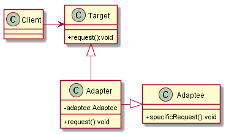

# 适配器模式
## 1. 定义
将一个类的接口变成客户端所期待的另一种接口，从而使原本因接口不匹配而无法在一起工作的两个类能够在一起工作
## 2. 类图

## 3. 优缺点
### 3.1 优点
* 适配器模式可以让两个没有任何关系的类在一起运行，只要适配器这个角色能够搞定他们就行
* 增加了类的透明性
* 提高了类的复用度
* 灵活性非常好
## 4. 使用场景
* 修改一个已经投产中的接口时，适配器模式可能是最适合的

