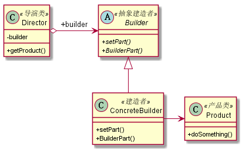

# 建造者模式
## 1. 定义
* 建造者模式也叫生成器模式
* 定义：将一个复杂对象的构建与它的表示分离，使得同样的构建过程可以创建不同的表示。
## 2. 类图

## 3. 优缺点
### 3.1 优点
* 封装性：使用建造者模式可以使客户端不必知道产品内部的组成细节。
* 建造者独立，容易扩展
* 便于控制细节风险：由于具体的建造者是独立的，因此可以对建造过程逐步细化，而不对其他模块产生任何影响
## 4. 使用场景
* 相同的方法，不同的执行顺序，产生不同的事件结果时，可以采用建造者模式
* 多个部件或零件，都可以装配到一个对象中，但是产生的结果又不相同时，可以使用建造者模式
* 产品类非常复杂，或者产品类中的调用顺序不同产生了不同的效能，这个时候使用建造者模式非常合适
* 在对象的创建过程中使用到了系统中的其他对象，这些对象在产品对象的创建过程中不易得到时，可以使用建造者模式封装该对象的创建过程。
## 5. 扩展
* 使用建造者模式时，考虑引入模板方法模式
