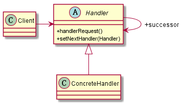

# 责任链模式
## 1. 定义
使多个对象都有机会处理请求，从而避免了请求的发送者和接受者之间的耦合关系。将这些对象连成一条链，并沿着这条链传递该请求，直到有对象处理它为止。
## 2. 类图

## 3. 优缺点
### 3.1 优点
* 将请求和处理分开。请求者可以不需要知道谁处理的，处理者可以不用知道请求的全貌。两者解耦，提高系统的灵活性。
### 3.2 缺点
* 性能问题，每个请求从链头遍历到链尾，链比较长的时候性能是个大问题。
* 调试不方便
## 4. 注意事项
* 控制链的长度，可以在Handler中设置一个最大节点数，在setNext方法中判断是否已经超过其阈值，超过则不允许建立，避免无意识地破坏系统性能

