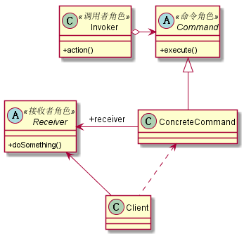

# 单例模式
## 1. 定义
命令模式是一个高内聚的模式，其定义如下：将一个请求封装成一个对象，从而让你使用不同的请求把客户端参数化，对请求排队或者记录请求日志，可以提供命令的撤销和恢复的功能。
## 2. 类图

## 3. 优缺点
### 3.1 优点
* 类间解耦：调用者与接收者之间没有任何依赖关系，调用者实现功能时不需了解到底是哪个接收者执行的。
* 可扩展性：Command子类可以非常容易的扩展
* 命令模式结合其他模式会更优秀：结合责任链模式，实现命令族解析任务。结合模板方法模式，可以减少Command子类的膨胀问题。
### 3.2 缺点
* 子类膨胀问题：如果有N个命令就需要对应N个Command的子类
## 4. 使用场景
* 只要你认为是命令的地方就可以采用命令模式
## 5. 扩展
### 5.1 反悔问题
* 发出一个命令还没有被执行，这时的撤销只需要重新setCommand就可以了
* 已经执行的命令如何撤销
    * 结合备忘录模式还原最后状态，该方法适合接收者为状态的变更情况，而不适合事件处理
    * 通过增加一个新命令，实现事件回滚

