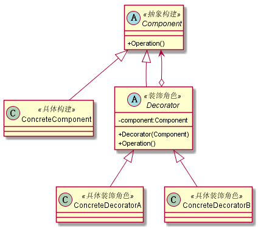

# 装饰者模式
## 1. 定义
动态地给一个对象添加一些额外的职责。就增加功能来说，装饰者模式相比生成子类更为灵活。
## 2. 类图

## 3. 优缺点
### 3.1 优点
* 装饰类和被装饰类可以独立发展，而不会互相耦合
* 装饰模式是继承关系的一个替代方案
* 装饰模式可以动态地扩展一个实现类的功能 
### 3.2 缺点
* 多层的装饰比较复杂，应尽量减少装饰类的数量
## 4. 使用场景
* 需要扩展一个类的功能，或给一个类增加附加功能
* 需要动态地给一个对象增加功能，这些功能可以再动态地撤销
* 需要为一批的兄弟类进行改装或加装功能
