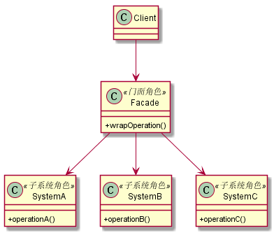

# 门面模式
## 1. 定义
也叫外观模式，要求一个子系统的外部与其内部的通信必须通过一个统一的对象进行。门面模式提供一个高层次的接口，使得子系统更易于使用。
## 2. 类图

## 3. 优缺点
### 3.1 优点
* 减少系统的相互依赖
* 提高了灵活性：只要不影响门面对象，子系统可以随意变化
* 提高了安全性
### 3.2 缺点
* 不符合开闭原则，对修改关闭，对扩展开放。一旦发现有一个小错误，只能修改门面角色代码
## 4. 使用场景
* 为一个复杂的模块或子系统提供一个供外界访问的接口
* 子系统相对独立——外界对子系统的访问只要黑箱操作即可
* 预防低水平人员带来的风险扩散
## 5. 注意事项
### 5.1 一个子系统可以有多个门面
* 门面已经庞大到不能忍受的程度（超过200行代码）
* 子系统可以提供不同的访问路径
### 5.2 门面不参与子系统内部的业务逻辑
