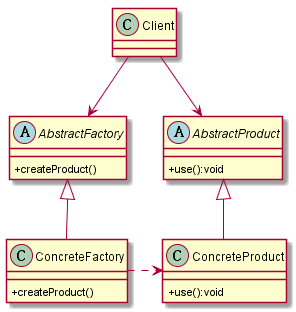
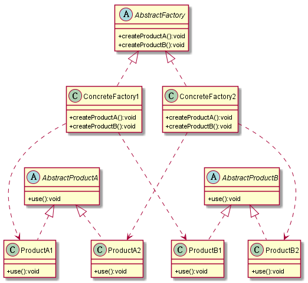

#工厂方法模式
##1. 定义
为创建一组相关或互相依赖的对象提供一个接口，而且无需指定它们的具体类。
##2. UML图
###2.1 类图

##3. 优缺点
###3.1 优点
* 抽象工厂模式隔离了具体类的生成，使得客户并不需要知道什么被创建。
* 当一个产品族中的多个对象被设计成一起工作时，它能够保证客户端始终只使用同一个产品族中的对象。
* 增加新的具体工厂和产品族很方便，无须修改已有系统，符合“开闭原则”。
##4. 使用场景
* 在添加新的产品对象时，难以扩展抽象工厂来生产新种类的产品，这是因为在抽象工厂角色中规定了所有可能被创建的产品集合，要支持新种类的产品就意味着要对该接口进行扩展，而这将涉及到对抽象工厂角色及其所有子类的修改，显然会带来较大的不便。
* 开闭原则的倾斜性（增加新的工厂和产品族容易，增加新的产品等级结构麻烦）。
