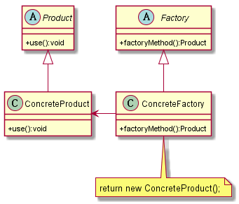
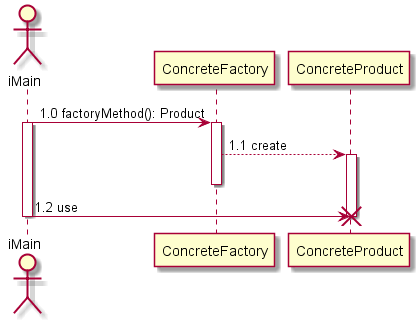

#工厂方法模式

##1. 定义
定义一个用于创建对象的接口，让子类确定实例化哪一个类。工厂方法使一个类的实例化延迟到其子类。

##2. UML图

###2.1 类图

###2.2 时序图

##3. 优缺点

###3.1 优点
* 良好的封装性，代码结构清晰
* 优秀的扩展性
* 屏蔽产品类
* 典型的解耦框架

##4. 使用场景
* 替换new一个对象
* 需要灵活的、可扩展的框架时，可以考虑
* 可以用在异构项目中，例如通过WebService与一个非Java项目交互
* 可以使用在测试驱动开发的框架下

##5. 扩展

###5.1 缩小为简单工厂
>* [简单工厂模式](../simplefactory/README.md)

###5.2 升级为多个工厂类

###5.3 替代单例模式

###5.4 延时初始化
