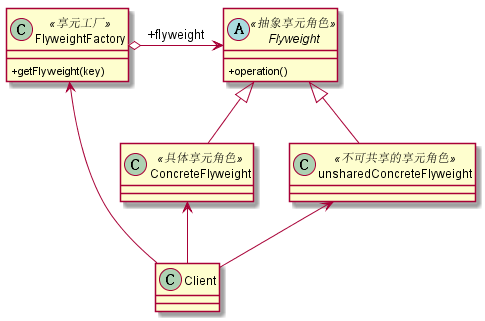

# 享元模式
## 1. 定义
* 定义：享元模式是池技术的重要实现方式，其定义如下：使用共享对象可有效地支持大量的细粒度的对象。
* 享元模式提出两个要求：细粒度对象和共享对象
* 细粒度对象，对象数量多且性质相近。我们将这些对象的信息分为2部分：内部状态和外部状态
    >* 内部状态: 对象可共享出来的信息，存储在享元对象内部且不会随环境的改变而改变。
    >* 外部状态: 对象得以依赖的一个标记，是随环境的改变而改变的、不可以共享的状态。
## 2. 类图

## 3. 优缺点
### 3.1 优点
* 大大减少应用程序创建对象的数量
* 降低程序的内存占用
* 增强程序性能
### 3.2 缺点
* 提高了系统复杂性：需要分离内外部状态，且外部状态具有固化特性，不应随内部状态的改变而改变，否则将导致系统混乱
## 4. 使用场景
* 系统中存在大量的相似对象
* 细粒度的对象都具备较接近的外部状态，而且内部状态与环境无关，也就是说对象没有特定身份
* 需要缓冲池的场景
## 5. 扩展
### 5.1 线程安全问题
在多线程的场景下，享元模式有大概率会出现线程安全问题。因为池中的对象数量少，被同时修改的可能性大。
### 5.2 性能平衡
尽量使用基本类型作为外部状态