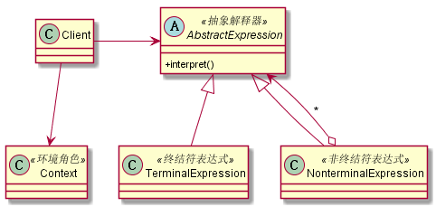

# 解释器模式
## 1. 定义
解释器模式是一种按照规定的语法进行解析的方案，在现在的项目中使用较少，其定义如下：给定一门语言，定义它的文法的一种表示，并定义一个解释器，该解释器使用该表示来解释语言中的句子。
## 2. 类图

## 3. 优缺点
### 3.1 优点
* 解释器是一个简单的语法分析工具，最显著的优点就是扩展性。修改语法规则只要修改相应的非终结符表达式就可以了，若要扩展语法，则只要增加非终结符类就可以了。
### 3.2 缺点
* 解释器模式会引起类膨胀
* 解释器模式采用递归调用方法
* 效率问题
## 4. 使用场景
* 重复发生的问题可以使用解释器模式：例如对日志文件进行分析处理
* 一个简单语法需要解释的场景

