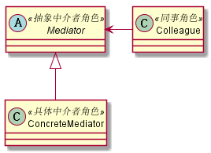

# 中介者模式
## 1. 定义
用一个中介对象封装一系列的对象交互，中介者使各对象不需要显示地相互作用，从而使其耦合松散，而且可以独立地改变它们之间的交互。
## 2. 类图

## 3. 优缺点
### 3.1 优点
* 减少类间依赖，降低类间耦合。把原有的一对多的依赖变成一对一的依赖，同事类只依赖中介者。
### 3.2 缺点
* 中介者会膨胀的很大，而且逻辑复杂
## 4. 使用场景
* 中介者模式适用于多个对象之间紧密耦合的情况，紧密耦合的标准是:在类图中出现了蜘蛛网状结构。
## 5. 实际应用
* 机场调度中心
* MVC框架：其中Controller就是一个中介者
* 媒体网关：如MSN服务器
* 中介服务

