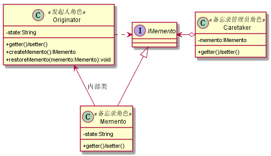

# 备忘录模式
## 1. 定义
备忘录模式提供了一种弥补真实世界缺陷的方法，让“后悔药”在程序世界中真实可行，其定义如下：在不破坏封装性的前提下，捕获一个对象的内部状态，并在该对象之外保存这个状态。这样以后就可将该对象恢复到原先保存的状态。
## 2. 类图

## 3. 应用
备忘录模式有很多的变形和处理方式，标准的备忘录模式很难在项目中遇到
### 3.1 使用场景
* 需要保存和恢复数据的相关状态场景
* 提供一个可回滚的操作
* 需要监控的副本场景
* 数据库连接的事物管理就是用的备忘录模式
### 3.2 注意事项
* 备忘录的生命周期
    * 备忘录创建出来就要在“最近”的代码中使用。建立就要使用，不使用就要删除。
* 备忘录性能
    * 不要在频繁建立备份的场景中使用备忘录模式：（1）控制不了备忘录建立的数量，（2）大对象的建立是要消耗资源的，系统的性能需要考虑 
## 4. 扩展
### 4.1 clone方式的备忘录
#### 4.1.1 类图

### 4.2 多状态的备忘录模式
#### 4.2.1 类图

### 4.3 多备份的备忘录
需要注意内存溢出问题，建议增加Map的上限，否则很容易产生内存溢出
### 4.4 封装性良好的备忘录——使用内部类的备忘录模式
#### 4.4.1 类图

