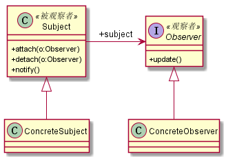

# 观察者模式
## 1. 定义
观察者模式也叫做发布/订阅模式，它是一个在项目中经常使用到的模式，定义如下：定义对象间一种一对多的依赖关系，使得每当一个对象改变状态，则所有依赖于它的对象都会得到通知。并被自动更新。
## 2. 类图

## 3. 优缺点
### 3.1 优点
* 观察者和被观察者之间是抽象耦合
* 建立一套出发机制
### 3.2 缺点
* 需要考虑开发效率和运行效率
## 4. 使用场景
* 关联行为场景。需要注意，关联行为是可拆分的，不是组合关系。
* 事件多级触发场景
* 跨系统的消息交换场景，如消息队列的处理机制
## 5. 注意事项
* 广播链问题：一个角色既是观察者又是被观察者，会联动触发
* 异步处理
## 6. 扩展
### 6.1 Java世界中的观察者模式
Java提供了观察者的类：类java.util.Observable 和 接口java.util.Observer
### 6.2 项目中真实的观察者模式
* 观察者和被观察者之间的消息沟通
* 观察者响应方式
* 被观察者尽量自己做主
* 订阅发布模式
