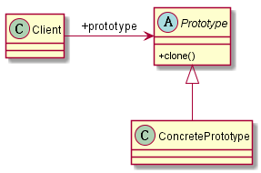

# 原型模式
## 1. 定义
* 用原型实例指定创建对象的种类，并且通过拷贝这些原型创建新的对象
* 原型模式简单程度仅次于单例模式和迭代器模式
## 2. 类图

## 3. 优缺点
### 3.1 优点
* 性能优良 ： 原型模式是在内存二进制流的拷贝，要比直接new一个对象性能好很多，特别是要在一个循环体内产生大量的对象时，原型模式可以更好地体现其优点。
* 逃避构造函数的约束：直接在内存中拷贝，构造函数是不会被执行的。这既是它的优点也是它的缺点。
## 4. 使用场景
* 资源优化场景：类的初始化需要消耗很多资源的情况
* 性能和安全要求的场景：通过new产生对象需要非常繁琐的数据准备或访问权限，则可以使用原型模式
* 一个对象多个修改者的场景: 一个对象需要提供给其他对象访问，而且各调用者都需要修改其值时，可以考虑使用原型模式拷贝多个对象供调用者使用
## 5. 注意事项
### 5.1 构造函数不会被执行
### 5.2 浅拷贝和深拷贝
### 5.3 clone与final两个冤家
* 成员变量不能是final的，否则不能拷贝
