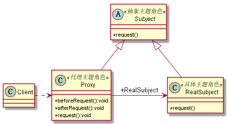
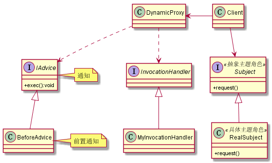

# 代理模式
## 1. 定义
代理模式是一个使用率非常高的模式，其定义如下：为其他对象提供一种代理以控制对这个对象的访问。
## 2. 类图
* 一般代理类图

* 动态代理类图

## 3. 优缺点
### 3.1 优点
* 职责清晰
* 高扩展性
* 智能化
## 4. 使用场景
* 使用场景很多，如SpringAOP
## 5. 扩展
### 5.1 普通代理
普通代理就是我们要知道代理的存在，然后才能访问。
### 5.2 强制代理
你必须经过真实角色查找到代理角色，否则你不能访问。
不管是通过代理类还是通过直接new一个主题角色，都不能访问，只有通过真实角色指定代理类才可以访问，也就是说由真实角色管理代理角色。
### 5.3 代理是有个性的
一个类可以实现多个接口，完成不同任务的整合。也就是说代理类不仅仅可以实现主题接口，也可以实现其他接口完成不同的任务。
### 5.4 虚拟代理
在需要的时候才初始化主题对象，可以避免被代理对象较多而引起的初始化缓慢的问题。
其缺点是需要在每个方法中判断主题对象是否被创建，这就是虚拟代理。
### 5.5 动态代理
* 动态代理是在实现阶段不用关心代理谁，而在运行阶段才指定代理哪一个对象。
* 面向切面编程AOP(Aspect Oriented Programming),其核心就是采用了动态代理机制。
