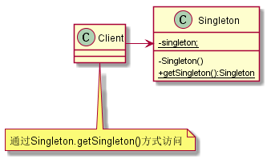

#单例模式
##1. 定义
保证一个类仅有一个实例，并提供一个访问它的全局访问点。
##2. 类图

##3. 优缺点
###3.1 优点
* 减少内存开支
* 减少性能开销：读取配置，产生依赖对象
* 避免对资源的多重占用
* 可以设置系统的全局访问点，优化和共享资源访问
###3.2 缺点
* 单例模式一般没有接口，扩展很困难
* 对测试不优化，无法mock
* 与单一职责原则有冲突。单例模式把“要单例”和业务逻辑融合在一起
##4. 使用场景
* 要生成唯一序列号的环境
* 整个项目需要一个共享访问点或共享数据。如：计数器
* 创建一个对象需要消耗的资源过多，如访问IO和数据库等资源
* 需要定义大量的静态常量和静态方法（工具类）
##5. 七种写法
###5.1 饿汉模式
[Singleton1](Singleton1.java)
###5.2 懒汉模式（线程不安全）
[Singleton2](Singleton2.java)
###5.3 懒汉模式（线程安全）
[Singleton3](Singleton3.java)
###5.4 双重检查模式（DCL）
[Singleton4](Singleton4.java)
###5.5 静态内部类单例模式
[Singleton5](Singleton5.java)
###5.6 枚举单例
[Singleton6](Singleton6.java)
###5.7 使用容器实现单例
[Singleton7](Singleton7.java)
##6. 扩展
N例模式：保证一个类仅有N个实例，并提供一个访问它的全局访问点。

