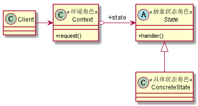

# 状态模式
## 1. 定义
当一个对象内在状态改变时允许其改变行为，这个对象看起来像改变了其类。状态模式的核心是封装，状态的变更引起了行为的变更，从外部看起来就好像这个对象对应的类发生了改变一样。
## 2. 类图

## 3. 优缺点
### 3.1 优点
* 结构清晰：避免了过多的switch...case或if...else语句
* 遵循设计原则：体现了开闭原则和单一职责
* 封装性非常好
### 3.2 缺点
* 类膨胀问题：状态多的时候子类会太多
## 4. 使用场景
* 行为随状态的改变而改变的场景
* 条件、分支判断语句的替代者
## 5. 注意事项
使用时对象的状态最好不要超过5个

