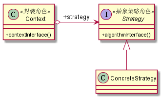

# 策略模式
## 1. 定义
定义一组算法，将每个算法都封装起来，并且使他们之间可以互换。
## 2. 类图

## 3. 优缺点
### 3.1 优点
* 算法可以自由切换
* 避免使用多重条件判断
* 扩展性良好
### 3.2 缺点
* 策略类数量增多
* 所有的策略类都需要对外暴露
## 4. 使用场景
* 多个类只有在算法或行为上稍有不同的场景
* 算法需要自由切换的场景
* 需要屏蔽算法规则的场景
## 5. 注意事项
策略家族的具体策略数量超过4个，就要考虑使用混合模式

