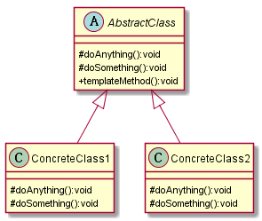

# 模板方法模式
## 1. 定义
定义一个操作中的算法的框架，而将一些步骤延迟到子类中。使得子类可以不改变一个算法的结构即可重新定义该算法的某些特定步骤。
## 2. 类图

## 3. 优缺点
### 3.1 优点
* 封装不变部分，扩展可变部分
* 提取公共部分代码，便于维护
* 行为由父类控制，子类实现，符合开闭原则
### 3.2 缺点
* 子类的执行结果对父类的结果产生了影响
## 4. 使用场景
* 多个子类有公有的方法，并且逻辑基本相同
* 重要、复杂的算法，可以把核心算法设计为模板方法，周边的相关细节功能则由子类实现
* 重构时，模板方法模式是一个经常使用的模式，把相同的代码抽取到父类中，然后通过钩子函数约束其行为

