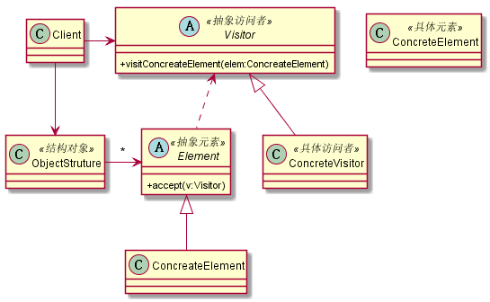

# 访问者模式
## 1. 定义
封装一些作用于某种数据结构中的各元素的操作，它可以在不改变数据结构的前提下定义作用于这些元素的新的操作。
## 2. 类图

## 3. 优缺点
### 3.1 优点
* 符合单一职责原则
* 优秀的扩展性
* 灵活性非常高
### 3.2 缺点
* 具体元素对访问者公布细节
* 具体元素变更比较困难
* 违背了依赖倒置原则
## 4. 使用场景
* 一个对象结构包含很多类对象，它们有不同的接口，而你想对这些对象实施一些依赖于其具体类的操作，也就说是用迭代器模式已经不能胜任的情景。
* 需要对一个对象结构中的对象进行很多不同并且不相关的操作，而你想避免让这些操作“污染”这些对象的类。
## 5. 扩展
### 5.1 统计功能
### 5.2 多个访问者
### 5.3 双分派
